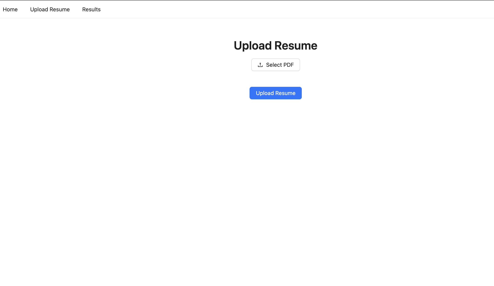
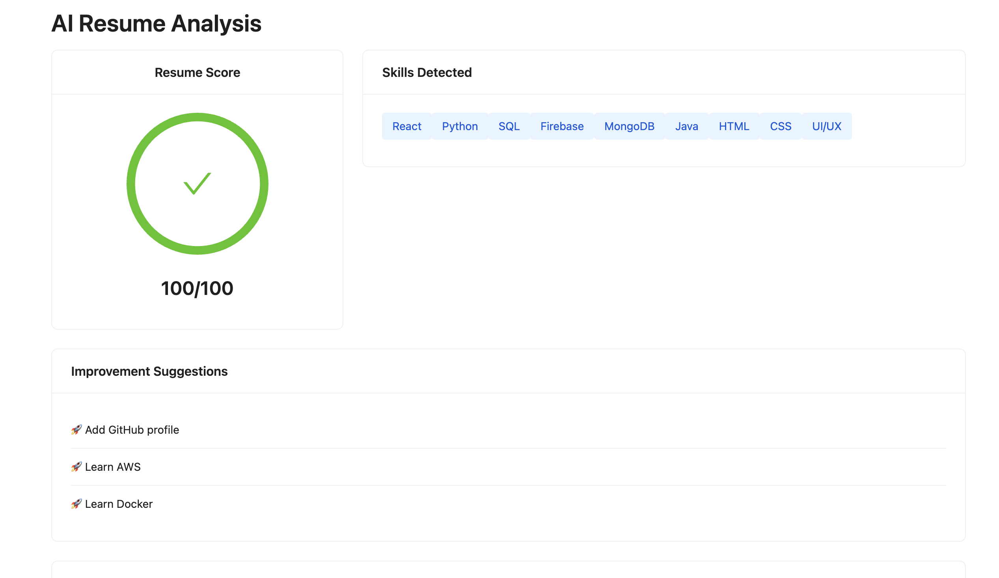

# 🚀 AI Resume Analyzer

A full-stack Resume Analyzer built using React, FastAPI, and Python.

## 📌 Features

* Upload Resume PDF
* Extract Resume Text
* Detect Technical Skills
* Generate Resume Score
* Resume Improvement Suggestions
* Modern Dashboard UI

---

## 📷 Screenshots

### Upload Resume Page



### Resume Analysis Dashboard



---

## 🛠️ Tech Stack

### Frontend

* React.js
* Ant Design
* Axios
* React Router

### Backend

* FastAPI
* Python
* PyPDF2

---

## ⚙️ Installation

### Frontend

```bash
npm install
npm run dev
```

### Backend

```bash
cd backend
source venv/bin/activate
pip install fastapi uvicorn python-multipart PyPDF2
uvicorn main:app --reload
```

---

## 🔮 Future Improvements

* ATS Compatibility Score
* AI Interview Questions
* OpenAI Integration
* Resume Keyword Analysis
* Resume Improvement Recommendations

---

## 👨‍💻 Author

**Nikhil Kosaraju**

Computer Science Engineering Student

React.js | Python | Firebase | UI/UX
